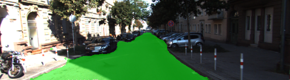
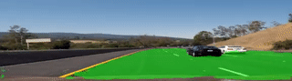

# Semantic Segmentation
Udacity Self-Driving Car Engineer Nanodegree Program

---

### Overview
This project uses [semantic segmentation](https://wiki.tum.de/display/lfdv/Image+Semantic+Segmentation) to find the pixels in an arbitrary image corresponding to the road in that image. The architecture is inspired by [a paper from U.C. Berkeley](https://people.eecs.berkeley.edu/~jonlong/long_shelhamer_fcn.pdf) describing the use of fully-convolutional networks to extract semantic information from images. I am deeply obligated to the datasets from [Kitti](http://www.cvlibs.net/datasets/kitti/raw_data.php) and [Cityscapes](https://www.cityscapes-dataset.com/), made available through an educational license.

### Architecture overview
A pre-trained [VGG-16](http://www.robots.ox.ac.uk/~vgg/research/very_deep/) model is followed by 1x1 and transpose convolutions to effectively reverse the VGG network output back to the original image dimensions. In order to keep structural information from the original image intact, "skip" layers are added between the VGG model layers and layers in the decoder. The resulting output is an image with the same dimensions as the source image, but with two "color" channels: one representing the pixels determined to be within a road, and one channel representing the non-road pixels.

## Files
[helper.py](https://github.com/gardenermike/semantic-segmentation/blob/master/helper.py) defines helper functions that load and prepare the data. It is lightly edited from the original version from Udacity's [project repository](https://github.com/udacity/CarND-Semantic-Segmentation) to load the Cityscapes dataset and horizontally flip images at random.
[main.py](https://github.com/gardenermike/semantic-segmentation/blob/master/main.py) implements the model and training.

## Discussion

Fully Convolutional Networks (FCNs) are a neural network implementation that uses convolution in _every_ layer, rather than the normal "dense" layers usually added to the end of the network for classification. 1x1 convolutions take the place of the flattened layer. The chief advantage of a 1x1 convolution in this network is that the convolution preserves the structure of the input image, rather than throwing it away in the classification step. By preserving the 2D structure of the input image, classification can be performed end-to-end through a single network, rather than applying classifiers to multiple regions of the image in the way classifiers like [YOLO](https://pjreddie.com/darknet/yolo/) do.
Instead of predicting boxes around regions believed to contain object types, the end-to-end FCN approach predicts object categories on a *per-pixel* basis. Such a prediction has the potential for much better granularity than what boxes could provide, as well as 100% image coverage. However, the trade-off is for computational complexity. Although convolutions are efficient, the encoder/decoder architecture is still computationally relatively expensive. However, the efficient implentation here (inspired by the orignal paper) can process multiple frames per second on a GPU, allowing for plausible use in a production setting.

The most interesting code is in the [layers function](https://github.com/gardenermike/semantic-segmentation/blob/master/main.py#L49) in main.py, which defines the model. Note that I use a steadily decreasing number of channels per convolution (from 1024 down to 2) to mirror the increasing channel count on the VGG side. Also notable are the two "skip" layers, which simply add layers from the VGG model to the transpose convolution outputs. These "skip" layers preserve the structure of the source image, but allow the decoded layers to affect the output. Also notable is that the category count is not hard-coded. The Cityscapes dataset defines a number of different categories. This implementation could easily be expanded to classify pedestrians, vehicles, and more.

I originally trained using only the Kitti dataset. This dataset is relatively small. The tremendous amount of manual labor involved in splitting an image pixel-wise into categories means that even a few hundred images are an impressive set of data, in contrast to the millions of images the ImageNet dataset, for example. Test images from my best run on the Kitti data set is contained in [the first runs directory](https://github.com/gardenermike/semantic-segmentation/tree/master/runs/1519446589.2163687) I then applied for access to the Cityscapes dataset, which contains several thousand images. Training on the larger dataset, I was able to get much better results. See the latest runs directory for examples from the difference. On a per-pixel basis in training, I was able to acheive 97% accuracy after training around 16 epochs using the combined Kitti and Cityscapes datasets.

To effectively double the size of my dataset, I also [horizontally flip 50% of the images at random](https://github.com/gardenermike/semantic-segmentation/blob/master/main.py#L131) during training.

Further exploration could include:
  * Adjusting the number of channels per-layer to balance performance and processing time
  * Adding additional categories available from the Cityscapes or other datasets
  * Adding further data augmentations, such as shadows, zooms, or skew.

Results on the Kitti test set are available in the [runs](https://github.com/gardenermike/semantic-segmentation/tree/master/runs) directory. I also generated [a video](https://github.com/gardenermike/semantic-segmentation/blob/master/segmented_video.mp4) using an unrelated video file.
